# 📋 Editorial Review Prompt Template

**Purpose:** Systematically review all markdown files in a repository for grammar, links, consistency, and cohesion.

---

## Table of Contents

- [Workflow Overview](about:blank#workflow-overview)
- [Formatting Standards (Schema)](about:blank#formatting-standards-schema)
- [Quick Start (TL;DR for AI)](about:blank#quick-start)
- [Instructions for AI](about:blank#instructions-for-ai)
  - [Step 1: Confirm and Clarify](about:blank#step-1-confirm-and-clarify)
  - [Step 2: Create Findings Document](about:blank#step-2-create-findings-document)
  - [Step 3: Review Files One by One](about:blank#step-3-review-files-one-by-one)
  - [Step 4: Generate Final Summary](about:blank#step-4-generate-final-summary)
  - [Step 5: Final Report to User](about:blank#step-5-final-report-to-user)
- [Technical Implementation Details](about:blank#technical-implementation-details)
- [Decision Rules for AI](about:blank#decision-rules-for-ai)
- [Important Guidelines](about:blank#important-guidelines)
- [Edge Cases & FAQs](about:blank#edge-cases--faqs)
- [Complete Example Flow](about:blank#complete-example-flow)
- [Checklist for AI](about:blank#checklist-for-ai)
- [Output Validation Checklist](about:blank#output-validation-checklist)

---

## Workflow Overview

```mermaid
flowchart TD
    Start([User: Review all markdown files]) --> Step1[Step 1: Confirm & Clarify]
    Step1 --> Scan[Scan repository for .md files]
    Scan --> List[List files alphabetically]
    List --> Confirm{User confirms?}
    Confirm -->|Yes| Step2[Step 2: Create EDITORIAL_REVIEW_FINDINGS.md]
    Confirm -->|No/Subset| Step2

    Step2 --> InitDoc[Initialize document with<br/>Legend, Progress, placeholders]
    InitDoc --> Step3[Step 3: Review Files One by One]

    Step3 --> Loop{More files?}
    Loop -->|Yes| AddEntry[Add file entry<br/>Status: REVIEWING]
    AddEntry --> ReadFile[Read file content]
    ReadFile --> Check[Check:<br/>Grammar, Links, Consistency,<br/>Structure, Formatting]

    Check --> HasIssues{Found issues?}
    HasIssues -->|Yes| FixDecide{Fix immediately?}
    FixDecide -->|Yes - Objective error| FixIt[Fix & document]
    FixDecide -->|No - Needs judgment| TrackIt[Track/Defer & document]
    FixIt --> CheckObs
    TrackIt --> CheckObs
    HasIssues -->|No| CheckObs

    CheckObs{Flag observations?}
    CheckObs -->|Yes - Subjective| DocObs[Document observation<br/>with context & question]
    CheckObs -->|No| UpdateEntry
    DocObs --> UpdateEntry

    UpdateEntry[Update file entry<br/>Status: COMPLETED<br/>Issues, Observations]
    UpdateEntry --> UpdateHeader[Update document header<br/>Files Completed: +1<br/>Issues Found/Fixed: +X<br/>Observations: +Y]
    UpdateHeader --> Report[Report to user:<br/>Completed filename - X issues, Y fixed, Z obs]
    Report --> CheckPause{Every 10 files?}
    CheckPause -->|Yes| Pause[Pause & ask user]
    Pause --> Loop
    CheckPause -->|No| Loop

    Loop -->|No more| Step4[Step 4: Generate Final Summary]
    Step4 --> Stats[Calculate statistics]
    Stats --> Cohesion[Analyze repository cohesion]
    Cohesion --> Recommend[Generate recommendations<br/>Must/Should/Nice to Have]
    Recommend --> Release[Assess release readiness]
    Release --> Step5[Step 5: Final Report to User]
    Step5 --> Done([✅ Review Complete!])

    %% Color scheme matching AAID workflow
    style Start fill:#f9f9f9,stroke:#333,stroke-width:3px,color:#000
    style Step1 fill:#1976d2,stroke:#0d47a1,stroke-width:2px,color:#fff
    style Scan fill:#1976d2,stroke:#0d47a1,stroke-width:2px,color:#fff
    style List fill:#1976d2,stroke:#0d47a1,stroke-width:2px,color:#fff
    style Confirm fill:#fff3e0,stroke:#f57c00,stroke-width:2px,color:#000
    style Step2 fill:#f57c00,stroke:#e65100,stroke-width:2px,color:#fff
    style InitDoc fill:#f57c00,stroke:#e65100,stroke-width:2px,color:#fff
    style Step3 fill:#7b1fa2,stroke:#4a148c,stroke-width:3px,color:#fff
    style Loop fill:#f5f5f5,stroke:#666,stroke-width:2px,color:#000
    style AddEntry fill:#f5f5f5,stroke:#666,stroke-width:2px,color:#000
    style ReadFile fill:#f5f5f5,stroke:#666,stroke-width:2px,color:#000
    style Check fill:#f5f5f5,stroke:#666,stroke-width:2px,color:#000
    style HasIssues fill:#fff3e0,stroke:#f57c00,stroke-width:2px,color:#000
    style FixDecide fill:#fff3e0,stroke:#f57c00,stroke-width:2px,color:#000
    style FixIt fill:#c8e6c9,stroke:#388e3c,stroke-width:2px,color:#000
    style TrackIt fill:#ffebee,stroke:#d32f2f,stroke-width:2px,color:#000
    style CheckObs fill:#fff3e0,stroke:#f57c00,stroke-width:2px,color:#000
    style DocObs fill:#f3e5f5,stroke:#7b1fa2,stroke-width:2px,color:#000
    style UpdateEntry fill:#fff9c4,stroke:#f9a825,stroke-width:2px,color:#000
    style UpdateHeader fill:#fff9c4,stroke:#f9a825,stroke-width:2px,color:#000
    style Report fill:#fff9c4,stroke:#f9a825,stroke-width:2px,color:#000
    style CheckPause fill:#f5f5f5,stroke:#666,stroke-width:2px,color:#000
    style Pause fill:#f5f5f5,stroke:#666,stroke-width:2px,color:#000
    style Step4 fill:#7b1fa2,stroke:#4a148c,stroke-width:3px,color:#fff
    style Stats fill:#f3e5f5,stroke:#7b1fa2,stroke-width:2px,color:#000
    style Cohesion fill:#f3e5f5,stroke:#7b1fa2,stroke-width:2px,color:#000
    style Recommend fill:#f3e5f5,stroke:#7b1fa2,stroke-width:2px,color:#000
    style Release fill:#f3e5f5,stroke:#7b1fa2,stroke-width:2px,color:#000
    style Step5 fill:#7b1fa2,stroke:#4a148c,stroke-width:3px,color:#fff
    style Done fill:#4caf50,stroke:#2e7d32,stroke-width:3px,color:#fff
```



**Key Decision Points:**

- **Fix vs Track/Defer**: Grammar/links/consistency errors → Fix. Subjective/unclear → Track/Defer.
- **Issue vs Observation**: Objective error → Issue. Requires human judgment → Observation.
- **Continue vs Pause**: Every 10 files, pause for user confirmation.

---

## Formatting Standards (Schema)

**These formatting rules are MANDATORY for consistency:**

### Dates & Times

- **Date format:** `YYYY-MM-DD` (e.g., `2025-10-01`)
- **Time format:** `HH:MM` 24-hour (e.g., `14:30`)
- **DateTime format:** `YYYY-MM-DD HH:MM` (e.g., `2025-10-01 14:30`)

### Status Indicators

- **Status format:** `[Emoji] [TEXT IN CAPS]`
  - ✅ `🟡 IN PROGRESS`
  - ✅ `✅ COMPLETED`
  - ✅ `⏸️ DEFERRED`
  - ❌ NOT: `In Progress 🟡` or `Completed` or `✅ completed`

### Severity Indicators

- **Format:** `[Emoji] [Text in Title Case]`
  - ✅ `🔴 Critical`
  - ✅ `🟡 Medium`
  - ✅ `🟢 Low`
  - ❌ NOT: `Critical 🔴` or `🔴 CRITICAL`

### Numbers in Tables

- **Zero values:** Use `0` (not or `None`)
- **Placeholders in template:** Use `[#]`
- **Actual values:** Plain numbers, no formatting (e.g., `42` not `42 issues`)

### Percentages

- **Format:** One decimal place + `%` (e.g., `45.2%`)
- **Special case:** `100%` or `0%` (no decimals when whole numbers)

### File Paths

- **Format:** Relative from repository root, forward slashes
- **Example:** `appendices/appendix-a/file.md`
- ❌ NOT: `./appendices/appendix-a/file.md` or `\appendices\`

### Lists

- **Unordered:** Use (hyphen), one space after
- **Ordered:** Use `1.` `2.` etc., one space after
- **Checkboxes:** `[ ]` for unchecked, `[x]` for checked

### Headings

- **H1:** `#` (used only for document title)
- **H2:** `##` (used for major sections)
- **H3:** `###` (used for file entries)
- **H4:** `####` (used for subsections within files)
- **H5:** `#####` (used for individual issues)
- **Format:** One space after `#` symbols

### Code Blocks

- **Fenced with triple backticks:** ```
- **Language hint when applicable:** ```markdown
- **No language hint for plain text:** ```

### Tables

- **Header separator:** Use `|---|---|---|` format
- **Alignment:** Left-align text, right-align numbers (using `--:`)
- **Spacing:** One space padding inside each cell
- **Example:**
  ```markdown
  | Column 1 | Column 2 | Count || -------- | -------- | ----: || Text | Text | 42 |
  ```

### Horizontal Rules

- **Format:** Use `--` (three hyphens) on its own line
- **Spacing:** One blank line before and after

### Emphasis

- **Bold:** `*text**` (not `__text__`)
- **Italic:** `_text_` (not `text*`)
- **Inline code:** `text`

### Counters Format

- **In header:** `Files Completed: X/Y` (with space after colon)
- **In tables:** Just the number (e.g., `42`)

### Issue Numbering

- **Format:** `Issue #1:` `Issue #2:` etc.
- **Sequential:** Start at 1 for each file
- **Persistent:** Don’t renumber if issues are fixed

### Boolean Checks

- **Format:** `✅` for yes/true/good, `❌` for no/false/bad
- **In sentences:** Use emoji then text (e.g., `✅ Fixed` not `Fixed ✅`)

---

## Quick Start (TL;DR for AI)

1. Scan repo for .md files
2. Create EDITORIAL_REVIEW_FINDINGS.md with template
3. For each file: review → document → update counters
4. Generate summary with cohesion analysis
5. Report final status to user

## Instructions for AI

When a user asks you to perform an editorial review (e.g., “Review all markdown files” or “Editorial review of this repo”), follow this process exactly:

### Step 1: Confirm and Clarify

**First Response to User:**

```
I'll perform a comprehensive editorial review of your repository's markdown files.

I will:
1. Create EDITORIAL_REVIEW_FINDINGS.md to track all findings
2. Review each .md file systematically
3. Fix issues as I find them (when appropriate)
4. Document everything in the findings file
5. Provide a final summary

Scanning repository for markdown files...
```

**How to scan:** See [Technical Implementation Details → File Discovery](about:blank#file-discovery)

**Then list files found alphabetically:**

```
Found [X] markdown files:
- README.md
- docs/guide.md
- appendices/appendix-a.md
[...etc...]

Shall I proceed with reviewing all [X] files?
```

**If user says yes, proceed to Step 2**

**If user specifies subset:** “Only review X, Y, Z files” → Proceed with only those files

### Step 2: Create Findings Document

Create `/EDITORIAL_REVIEW_FINDINGS.md` with this exact structure:

```markdown
# Editorial Review Findings**Review Date:** YYYY-MM-DD

**Status:** 🟡 IN PROGRESS
**Files Completed:** 0/[TOTAL]
**Issues Found:** 0
**Issues Fixed:** 0
**Observations:** 0
This document tracks all findings from the comprehensive editorial review.

## Legend### Issue Types- 🔴 **Critical**: Broken links, factual errors, major grammar issues

- 🟡 **Medium**: Minor grammar, inconsistent terminology, style issues
- 🟢 **Low**: Suggestions, optional improvements

### Issue Status- ✅ **Fixed**: Issue resolved during review

- 📝 **Tracked**: Known issue, intentionally not fixed
- ⏸️ **Deferred**: To be addressed later

### Observations- 💭 **Observation**: Not an error, but something worth flagging for human consideration

- Potential improvements requiring judgment
- Questions about content/structure/format
- Subjective suggestions beyond mechanical fixes
- These are NOT fixed by AI - only documented for user review

## Review Progress*Check off sections as you complete them:*

- [ ] Core documentation
- [ ] Appendices/Supporting docs
- [ ] Templates/Commands
- [ ] Configuration files
- [ ] Consistency analysis
- [ ] Final summary

---

## Files Reviewed*Entries will be added here as files are reviewed.*

---

## Summary*Summary will be generated after all files are completed.*
```

### Step 3: Review Files One by One

**For EACH file:**

1. **Add a file entry immediately** (before reviewing):

```markdown
### 📄 path/to/file.md**Review Date:** YYYY-MM-DD HH:MM

**Status:** 🟡 REVIEWING
**Issues Found:** 0
**Issues Fixed:** 0
**Observations:** 0
_Review in progress..._

---
```

1. **Review the file** (read it using your file reading tool) checking:

   **Grammar & Mechanics:**

   - Subject-verb agreement (“The files is” → “The files are”)
   - Tense consistency (don’t switch between past/present/future within same context)
   - Pronoun agreement (“Each user should check their code” vs “his/her code”)
   - Sentence fragments (incomplete sentences lacking subject or verb)
   - Run-on sentences (multiple independent clauses improperly joined)
   - Comma splices (two sentences joined with only a comma)
   - Punctuation (missing periods, incorrect comma usage, apostrophes)
   - Capitalization consistency

   **Spelling:**

   - Typos and misspellings
   - Consistent spelling variants (e.g., “behavior” vs “behaviour” - pick one)

   **Links:**

   - Internal anchors, relative paths, external URLs, images
   - See [Technical Implementation Details → Link Verification](about:blank#link-verification)

   **Terminology Consistency:**

   - Key terms used consistently (same concept = same name)
   - Capitalization of terms (e.g., “Todo” vs “todo” vs “TODO”)
   - Acronyms defined on first use

   **Structure:**

   - Heading hierarchy (no skipped levels: H1 → H2 → H3, not H1 → H3)
   - TOC matches actual headings
   - No duplicate headings at same level (confuses anchor links)

   **Formatting Consistency:**

   - List styles (all bulleted or all numbered within same context)
   - Code block language hints
   - Bold/italic usage patterns
   - Table formatting

2. **Update the entry** with findings using this template:

```markdown
### 📄 path/to/file.md**Review Date:** YYYY-MM-DD HH:MM

**Status:** ✅ COMPLETED
**Issues Found:** [#]
**Issues Fixed:** [#]
**Observations:** [#]#### Issues[IF NO ISSUES:]✅ **No issues found**
**Review Summary:**

- ✅ Grammar and spelling correct
- ✅ All links working
- ✅ Consistent with repository standards
- ✅ Structure clear and logical
  [IF ISSUES FOUND, list each one:]##### Issue #1: [Brief Title]**Lines:** [specific line numbers]
  **Severity:** 🔴/🟡/🟢
  **Type:** Grammar | Link | Consistency | Structure | Other
  **Status:** ✅ Fixed | 📝 Tracked | ⏸️ Deferred
  **Description:**
  [Clear explanation of the problem]**Original:**
```

[Show the problematic content exactly as it appears]

```

**Resolution:**
[✅ Fixed to: "..." | 📝 Tracked because: ... | ⏸️ Deferred because: ...]

---

[Repeat for each issue]

#### Observations

[IF NO OBSERVATIONS:]
_No observations - file meets all standards._

[IF OBSERVATIONS EXIST:]

##### Observation #1: [Brief Title]

**Lines:** [specific line numbers or "General"]
**Category:** Content | Structure | Format | Tone | Consistency | Other
**Question/Suggestion:**
[Clear description of what you've noticed and why it might be worth considering]

**Context:**
[Provide relevant context: what's there now, why it caught your attention, what alternatives exist]

**User Decision Needed:**
[What question should the user answer? What choice should they make?]

---

[Repeat for each observation]

#### Review Notes
[Optional: overall quality assessment, relation to other files, patterns noticed]

---
```

1. **Update the document header** after each file:

   See [Technical Implementation Details → Document Update Pattern](about:blank#document-update-pattern) for exact sequence.

   ```markdown
   **Files Completed:** X/Y
   **Issues Found:** [total]**Issues Fixed:** [total]**Observations:** [total]
   ```

2. **Report to user**: “✅ Completed [filename] - Found X issues, Fixed Y, Z observations”

   See [Technical Implementation Details → Progress Reporting](about:blank#progress-reporting) for frequency.

3. **Continue to next file** without waiting (unless user interrupts or every 10 files)

### Step 4: Generate Final Summary

**After ALL files reviewed**, replace the Summary section with:

```markdown
## Summary**Review Completed:** YYYY-MM-DD

**Total Files Reviewed:** [#]### Statistics| Metric | Count || --------------------------- | ----- || **Total Issues Found** | [#] || **Issues Fixed** | [#] || **Issues Tracked** | [#] || **Issues Deferred** | [#] || **Observations Flagged** | [#] || **Files With No Issues** | [#] || **Files With Observations** | [#] |### Issue Breakdown by Severity| Severity | Count | Fixed | Remaining || ----------- | ----- | ----- | --------- || 🔴 Critical | [#] | [#] | [#] || 🟡 Medium | [#] | [#] | [#] || 🟢 Low | [#] | [#] | [#] |### Issue Breakdown by Type| Type | Found | Fixed || ------------------------ | ----- | ----- || Grammar/Spelling | [#] | [#] || Broken Links | [#] | [#] || Inconsistent Terminology | [#] | [#] || Structural Issues | [#] | [#] || Other | [#] | [#] |### Repository Cohesion Analysis**Terminology Consistency:**
[✅ Excellent | ✅ Good | 🟡 Some issues | 🔴 Significant issues]Details:

- [List key terms and whether they're used consistently]- [Note any problematic variations]**Tone & Voice:**
  [✅ Unified | 🟡 Mostly consistent | 🔴 Inconsistent]Details:
- [Describe the overall tone]- [Note any jarring shifts between documents]**Structural Consistency:**
  [✅ Well-organized | 🟡 Could improve | 🔴 Needs work]Details:
- [Comment on similar document patterns]- [Note where structure helps or hinders]**Cross-Reference Quality:**
  [✅ Excellent | ✅ Good | 🟡 Some broken | 🔴 Many broken]Details:
- [Note navigation between documents]- [Comment on link accuracy]**Code Example Consistency:**
  [✅ Consistent | 🟡 Mostly consistent | 🔴 Inconsistent]Details:
- [Comment on code style across examples]- [Note if examples use same domain/concepts]### Overall Cohesion Assessment**Grade:** [A+ | A | B | C | D | F][Write 2-3 paragraphs describing how well the repository works as a unified whole]Key strengths:
- [Strength 1]- [Strength 2]Areas for improvement:
- [Area 1]- [Area 2]### Recommendations#### 🔴 Must Fix (Before Release)[List ONLY issues that block release, or state "None"]1. [Critical blocker]2. [Critical blocker]#### 🟡 Should Fix (High Priority)[List important but non-blocking issues, or state "None"]1. [Important issue]2. [Important issue]#### 🟢 Nice to Have (Low Priority)[List optional improvements, or state "None"]1. [Optional improvement]2. [Optional improvement]### Files Requiring Attention[IF any files have issues, create this table:]| File | Issues | Priority | Quick Action || ------ | ------ | -------- | ------------------ || [path] | [#] | 🔴/🟡/🟢 | [What needs doing] |[IF no files have remaining issues:]✅ All files have been addressed - no files require additional attention.

### Release Readiness**Status:** [✅ READY NOW | 🟡 READY WITH FIXES | 🔴 NOT READY]**Assessment:**

[2-3 sentences explaining the status with specific evidence]**Blocking Issues:** [#][List specific blockers with file references, or state "None - ready to release"]**Recommended Action:**
[Clear next step: "Ship it!" or "Fix X and Y first, then ready" or "Significant work needed"]---
_Editorial Review Completed on YYYY-MM-DD_
```

### Step 5: Final Report to User

After completing everything, tell the user:

```
✅ Editorial Review Complete!

📊 Summary:
- Reviewed: X files
- Issues found: Y
- Issues fixed: Z
- Observations flagged: W
- Status: [READY/READY WITH FIXES/NOT READY]

📄 Full details: EDITORIAL_REVIEW_FINDINGS.md

[If issues remain:]
⚠️ Remaining issues to address: [list must-fix items]

[If observations exist:]
💭 Observations: [count] items flagged for your consideration

[If ready:]
🚀 Repository is ready for release!
```

---

## Technical Implementation Details

**How to implement each step using your available tools:**

### File Discovery

**How to find all markdown files:**

1. **If you have `glob_file_search` tool:** Use pattern `*/*.md`
2. **If you have `list_dir` tool:** Recursively list directories and filter for `.md` files
3. **If you have neither:** Ask user to provide list of markdown files

**Review Order:** Alphabetically by full path (e.g., `README.md` before `docs/guide.md` before `docs/setup.md`)

### Incremental Document Updates

**Critical:** Update `EDITORIAL_REVIEW_FINDINGS.md` after EACH file, not all at once at the end.

**How to update:**

1. **If you have `search_replace` tool:**
   - Use it to update specific sections (header counts, add file entries)
   - Update header after each file: `*Files Completed:** X/Y`
2. **If you don’t have `search_replace`:**
   - Recreate the entire document with updates
   - Preserve all previous entries

**Where to add new entries:** Always append after the last file entry, before the Summary section

### Link Verification

**How to check each link type:**

1. **Internal Anchors** (`#heading-id`):
   - Read the target file
   - Search for the heading (convert to lowercase, replace spaces with hyphens)
   - Verify heading exists
2. **Relative Paths** (`../other/file.md`):
   - Calculate the absolute path from current file location
   - Verify target file exists (use `read_file` with offset to check)
   - If file doesn’t exist → 🔴 Critical broken link
3. **External URLs** (`https://example.com`):
   - Check URL structure looks valid (has protocol, domain)
   - Don’t actually test HTTP status (slow/unreliable)
   - If URL is obviously malformed → 🟡 Medium issue
4. **Image Links**:
   - Same as relative paths if local
   - Same as external URLs if remote

### Progress Reporting

**After each file, tell user:**

```
✅ Completed [filename] - Found X issues, Fixed Y, Z observations
```

(If no observations: “✅ Completed [filename] - Found X issues, Fixed Y”)

**Every 10 files, pause and ask:**

```
Completed 10 files. Continue with next batch? (Y/n)
```

**If user doesn’t respond in 30 seconds, continue automatically** (they can interrupt if needed)

### Document Update Pattern

**After reviewing each file, update in this order:**

1. Add complete file entry (with all issues and observations documented)
2. Update header: `*Files Completed:** [increment by 1]`
3. Update header: `*Issues Found:** [add new issues]`
4. Update header: `*Issues Fixed:** [add newly fixed]`
5. Update header: `*Observations:** [add new observations]`
6. Report to user

**Example update sequence:**

```
1. Review file A → Found 2 issues (fixed 1), 1 observation
2. Update EDITORIAL_REVIEW_FINDINGS.md:
   - Add file A entry (with Issues section AND Observations section)
   - Files Completed: 0/22 → 1/22
   - Issues Found: 0 → 2
   - Issues Fixed: 0 → 1
   - Observations: 0 → 1
3. Report: "✅ Completed file A - Found 2 issues, Fixed 1, 1 observation"
4. Continue to file B
```

### Tool Availability Handling

**If you lack certain tools:**

- No `glob_file_search` → Ask user for file list
- No `search_replace` → Recreate entire document each time
- No `read_file` → Ask user if link targets exist
- Limited to X tokens output → Batch files in groups

**Always work within your tool constraints** - Don’t fail because a tool is missing, adapt the approach.

---

## Decision Rules for AI

### When to Fix vs Track vs Defer

**✅ Fix immediately when:**

- Clear grammar/spelling error
  - Example: “The files is complete” → “The files are complete”
  - Example: “He write code daily” → “He writes code daily”
- Tense inconsistency within same context
  - Example: “First, we created the file. Then we update it.” → “First, we created the file. Then we updated it.”
  - Example: “The user clicks submit and saw an error” → “The user clicks submit and sees an error”
- Broken internal link with obvious fix
- Obvious inconsistency (e.g., one doc uses “Todo” others use “TODO”)
- Missing punctuation
- Wrong heading level
- Spelling variants inconsistent (“behavior” in file A, “behaviour” in file B → standardize)

**📝 Track (don’t fix) when:**

- Intentional placeholder (like “Coming soon”)
- Style preference rather than error
- Would require understanding author’s intent
- External factors (waiting for published URL)

**⏸️ Defer when:**

- Requires discussion with author
- Significant rewrite needed
- Uncertain about correct approach
- User might have different preference

**When uncertain:** Default to ✅ Fix if it’s objectively wrong, 📝 Track if subjective.

### When to Flag Observations

**💭 Flag as Observation when:**

- Content might benefit from reorganization, but current structure is functional
  - Example: “Section X covers topics A, B, C. Section Y also mentions B. Consider consolidating B discussion?”
- Format choice is valid but alternatives might be better
  - Example: “This 4-paragraph explanation could be a comparison table. Would that improve scanability?”
- Tone shifts between sections/files, but not incorrect
  - Example: “Most docs use ‘we’, but this one uses ‘you’. Intentional distinction or inconsistency?”
- Potential duplication between documents
  - Example: “This content appears similar to section X in file Y. Is this intentional redundancy or should one reference the other?”
- Examples could be more complete/clear
  - Example: “Code example shows function call but not the function definition. Would including both help?”
- Terminology is consistent within file but differs from other files
  - Example: “This file uses ‘user story’, others use ‘scenario’. Align or keep distinct?”
- Missing content that might be expected
  - Example: “Section mentions ‘three strategies’ but only explains two. Is third missing or just not detailed?”
- Format/structure differs from similar documents
  - Example: “Other appendices have ‘Prerequisites’ section, this one doesn’t. Intentional or oversight?”
- Links work but might point to better targets
  - Example: “Link goes to page root, but section #specific-topic would be more precise”
- Technical level seems inconsistent with apparent audience
  - Example: “Doc is labeled ‘beginner guide’ but assumes knowledge of advanced concepts. Revise level or label?”

**What Observations Should NOT Be:**

- ❌ Grammar/spelling errors → These are Issues
- ❌ Broken links → These are Issues
- ❌ Clear factual errors → These are Issues
- ❌ Personal preferences with no rationale → Don’t document
- ❌ Vague “could be better” statements → Be specific or skip

**Observations should:**

- ✅ Provide specific context (line numbers, what’s there, what alternatives exist)
- ✅ Explain WHY it caught your attention
- ✅ Present a clear question or decision point for the user
- ✅ Be actionable (user can act on it or dismiss it)
- ✅ Respect author’s judgment (phrased as question, not directive)

### Severity Assignment

**🔴 Critical:**

- Broken links to key navigation
- Major factual errors
- Severe grammar that obscures meaning
- Missing critical sections

**🟡 Medium:**

- Minor grammar issues
- Inconsistent terminology
- Formatting issues
- Minor structural problems

**🟢 Low:**

- Stylistic suggestions
- Optional improvements
- Nice-to-have additions
- Minor polish items

### Consistency Checking

**Track these patterns across ALL files:**

1. Key terminology (how are main concepts named?)
2. Tone (formal? conversational? technical?)
3. Structure patterns (similar docs use similar formats?)
4. Example domains (do examples reference consistent concepts?)
5. Emoji usage (if used, consistent meanings?)
6. Code style (indentation, naming, patterns?)
7. Link style (relative vs absolute, with/without extensions?)

**Note patterns in individual file entries AND in final summary.**

---

## Important Guidelines

### DO:

✅ Fix obvious errors immediately

✅ Explain ALL decisions (why fixed OR why not)

✅ Flag observations for things that require human judgment

✅ Phrase observations as questions, not directives

✅ Update the document after EACH file (not all at once at end)

✅ Be thorough but efficient

✅ Check links by actually verifying paths/anchors

✅ Look for consistency across the entire repository

✅ Preserve the author’s voice and intent

✅ Give clear, actionable recommendations

### DON’T:

❌ Report subjective preferences as issues (use observations instead)

❌ Flag observations for clear errors (grammar/links are issues)

❌ Write vague observations like “could be better” (be specific)

❌ Rewrite content unnecessarily

❌ Wait until the end to update findings document

❌ Skip checking links because “they look ok”

❌ Ignore small issues (typos matter!)

❌ Make assumptions about unfixed placeholders

❌ Rush through files to finish faster

❌ Change technical terminology without certainty

---

## Edge Cases & FAQs

**Q: What if the repository is huge (100+ files)?**

A: After every 10 files, pause and ask: “Completed 10 files. Continue with next 10?” This prevents overwhelming output.

**Q: What if files are in subfolders with complex structure?**

A: Review in alphabetical order by full path. Group by directory in your report if helpful.

**Q: What if I find the same issue in many files?**

A: Fix it in each file, but in the summary note: “Pattern: [issue X] found in 15 files - all fixed.”

**Q: What if a file has dozens of issues?**

A: Document all of them. If it needs major work, note in Review Notes: “This file requires significant attention.”

**Q: What if user interrupts the process?**

A: The findings document shows progress. User can ask you to resume, and you continue from where you left off.

**Q: What if there are non-.md files that might need review?**

A: Stick to .md files unless user specifically requests others. Note in final summary: “Only .md files reviewed. Consider reviewing [other file types] separately.”

**Q: Should I check external URLs for HTTP status?**

A: Note if they exist and look correct. If a URL appears broken (404), mark as critical. Don’t verify every external URL unless obviously wrong.

**Q: How detailed should grammar checking be?**

A: Catch obvious errors. Don’t be pedantic about style unless it impacts clarity.

---

## Complete Example Flow

**User:** “Review all markdown files in this repository”

**AI Response 1:**

```
I'll perform a comprehensive editorial review of your repository's markdown files.

I will:
1. Create EDITORIAL_REVIEW_FINDINGS.md to track findings
2. Review each file systematically
3. Fix issues as I find them (when appropriate)
4. Document everything in the findings file

Scanning repository...

Found 22 markdown files:
- README.md
- docs/guide.md
- appendices/appendix-a.md
[...etc...]

Shall I proceed with reviewing all 22 files?
```

**User:** “Yes”

**AI Response 2:**

```
Creating EDITORIAL_REVIEW_FINDINGS.md...
✅ Created

Starting review...

📄 Reviewing README.md...
✅ Completed README.md - Found 2 issues, Fixed 1

📄 Reviewing docs/guide.md...
[continues...]
```

**[AI continues automatically through all files]**

**Final AI Response:**

```
✅ Editorial Review Complete!

📊 Summary:
- Reviewed: 22 files
- Issues found: 3
- Issues fixed: 2
- Observations flagged: 2
- Status: READY WITH ONE FIX

📄 Full details: EDITORIAL_REVIEW_FINDINGS.md

⚠️ One issue remaining:
- README.md line 45: Update placeholder link (low priority)

💭 Observations for your consideration:
- docs/guide.md: Section structure differs from similar docs - standardize?
- appendices/appendix-a.md: Content overlaps with main guide - consolidate or cross-reference?

🚀 Repository is essentially ready for release!
```

---

## Checklist for AI

Before you start, verify:

- [ ] User confirmed they want the review
- [ ] You know which files to review (all .md or specific subset)
- [ ] You’ve created EDITORIAL_REVIEW_FINDINGS.md
- [ ] You understand the file entry template
- [ ] You know when to fix vs track vs defer

As you work:

- [ ] Adding file entries BEFORE reviewing each file
- [ ] Updating entries with findings AS you review
- [ ] Updating header counts after each file
- [ ] Checking off “Review Progress” items as you complete each category
- [ ] Reporting progress to user
- [ ] Tracking consistency patterns

When finished:

- [ ] All files have complete entries
- [ ] Summary section fully generated
- [ ] Final status updated to COMPLETED
- [ ] User notified with summary
- [ ] Clear recommendations provided

---

## Output Validation Checklist

**Before finalizing the findings document, verify:**

### Schema Compliance

- [ ] All dates use `YYYY-MM-DD` format
- [ ] All times use `HH:MM` 24-hour format
- [ ] All status indicators follow `[Emoji] [CAPS]` format
- [ ] All severity indicators follow `[Emoji] [Title Case]` format
- [ ] All file paths are relative, use forward slashes, no `./` prefix
- [ ] All lists use for unordered, `1.` for ordered
- [ ] All headings have correct level and one space after `#`
- [ ] All tables properly formatted with aligned columns
- [ ] All horizontal rules are `--` with blank lines around them
- [ ] All emphasis uses `*bold**` and `_italic_`

### Content Completeness

- [ ] Document has title and metadata (date, status, counters including observations)
- [ ] Legend is present and matches standard (including observations section)
- [ ] Progress checklist is present
- [ ] Every reviewed file has complete entry with all required fields
- [ ] Every issue has: title, lines, severity, type, status, description, original, resolution
- [ ] Every observation has: title, lines, category, question/suggestion, context, user decision needed
- [ ] Observations section present in each file entry (even if empty)
- [ ] Summary section has all required subsections
- [ ] Statistics tables are complete and calculated correctly (including observations count)
- [ ] Cohesion analysis covers all required aspects
- [ ] Recommendations are categorized (Must/Should/Nice to Have)
- [ ] Release readiness section has clear status and reasoning

### Consistency Checks

- [ ] Issue numbering is sequential within each file (starts at #1)
- [ ] Observation numbering is sequential within each file (starts at #1)
- [ ] File paths match actual repository structure
- [ ] Counters in header match the sum of individual entries
- [ ] “Issues Found” matches number of issue entries
- [ ] “Issues Fixed” matches number of “✅ Fixed” statuses
- [ ] “Observations” matches number of observation entries
- [ ] Summary statistics match individual file data
- [ ] No duplicate file entries
- [ ] All referenced files are included in review

### Quality Checks

- [ ] Every decision has explanation (why fixed OR why not)
- [ ] All unfixed issues have clear reasoning
- [ ] All observations include specific context and clear question
- [ ] Observations are actionable (user can act or dismiss)
- [ ] Observations are phrased as questions, not directives
- [ ] No grammar/link errors flagged as observations (should be issues)
- [ ] Recommendations are specific and actionable
- [ ] Release status matches actual findings (critical issues → not ready)
- [ ] No subjective preferences reported as issues
- [ ] Consistency patterns are identified and noted
- [ ] Overall cohesion assessment is supported by evidence

### Format Validation Examples

**❌ WRONG:**

```markdown
### appendices/file.mdStatus: Completed ✅

**Issues Found**: 2
Date: 10/01/2025 2:30pm

##### Critical IssueLines 45
```

**✅ CORRECT:**

```markdown
### 📄 appendices/file.md**Review Date:** 2025-10-01 14:30

**Status:** ✅ COMPLETED
**Issues Found:** 2
**Issues Fixed:** 1
**Observations:** 1

##### Issue #1: [Issue Title]**Lines:** 45

**Severity:** 🔴 Critical

#### Observations##### Observation #1: Section Structure Differs from Similar Docs**Lines:** General

**Category:** Structure
**Question/Suggestion:**
This document uses a different heading structure than other appendices (starts with H2, others start with H3).
**Context:**
Appendices A, B, and C all begin content at H3 level. This one starts at H2.
**User Decision Needed:**
Should this be restructured to match the pattern, or is the difference intentional?
```

---

**This prompt ensures:** ✅ No ambiguity | ✅ Clear process | ✅ Consistent output | ✅ Strict schema | ✅ Self-validation | ✅ Human-judgment flagging

**What It Does:**

- ✅ Fixes clear errors (grammar, links, consistency)
- ✅ Tracks unfixable issues
- ✅ Flags observations requiring human judgment
- ✅ Provides comprehensive cohesion analysis
- ✅ Gives clear release readiness assessment

**What It Won’t Do (By Design):**

- ❌ Suggest reorganizing sections (flags as observation)
- ❌ Recommend rewriting paragraphs (flags as observation)
- ❌ Question format choices (flags as observation)
- ❌ Make subjective improvements (flags as observation)

**Use this by:** Providing it to any AI with the request: “Review all markdown files in this repository”
