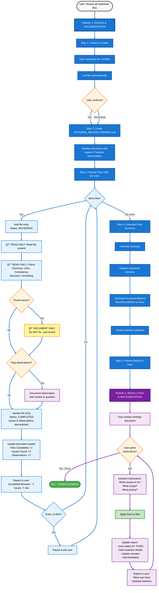

# 📋 Editorial Review Prompt Template v2

**Purpose:** Systematically review all markdown files in a repository for grammar, links, consistency, and cohesion through a two-phase workflow.

**Key Change from v1:** Phase 1 is **read-only** (review and document). Phase 2 is **human-directed** (implement fixes based on user instructions).

---

## Table of Contents

- [Workflow Overview](#workflow-overview)
- [Phase 1: Review & Documentation](#phase-1-review--documentation)
  - [Step 1: Confirm and Clarify](#step-1-confirm-and-clarify)
  - [Step 2: Create Findings Document](#step-2-create-findings-document)
  - [Step 3: Review Files (Read-Only)](#step-3-review-files-read-only)
  - [Step 4: Generate Final Summary](#step-4-generate-final-summary)
  - [Step 5: Present Report to User](#step-5-present-report-to-user)
- [Phase 2: Resolution & Implementation](#phase-2-resolution--implementation)
  - [User Review & Instructions](#user-review--instructions)
  - [Interpreting User Instructions](#interpreting-user-instructions)
  - [Applying Fixes](#applying-fixes)
  - [Report Update Rules](#report-update-rules)
  - [Verification After Fixes](#verification-after-fixes)
- [Formatting Standards (Schema)](#formatting-standards-schema)
- [Technical Implementation Details](#technical-implementation-details)
- [Decision Rules for AI](#decision-rules-for-ai)
- [Important Guidelines](#important-guidelines)
- [Edge Cases & FAQs](#edge-cases--faqs)
- [Complete Example Flow](#complete-example-flow)
- [Checklist for AI](#checklist-for-ai)
- [Output Validation Checklist](#output-validation-checklist)

---

## Workflow Overview



**Key Decision Points:**

- **Phase 1 (Blue)**: Read-only analysis. Document EVERYTHING, fix NOTHING.
- **Phase 2 (Purple)**: Human-directed implementation. Fix according to user instructions.
- **Document Only vs Apply Fixes**: Phase 1 never mutates files. Phase 2 mutates files following strict report update rules.

---

## Phase 1: Review & Documentation

**CRITICAL RULE FOR PHASE 1: READ-ONLY MODE**

- ✅ **ALLOWED**: Read files, analyze content, create/update EDITORIAL_REVIEW_FINDINGS.md
- ⌠**FORBIDDEN**: Modify any source files, fix issues, change content

**Purpose:** Provide a comprehensive analysis of all issues and observations without making any changes.

---

### Step 1: Confirm and Clarify

**First Response to User:**

```
I'll perform a comprehensive editorial review of your repository's markdown files.

PHASE 1: REVIEW & DOCUMENTATION (Read-Only)
I will:
1. Create EDITORIAL_REVIEW_FINDINGS.md to track all findings
2. Review each .md file systematically
3. Document all issues and observations (NO fixes applied)
4. Provide a comprehensive report

PHASE 2: RESOLUTION & IMPLEMENTATION (After your review)
You will:
1. Review the findings document
2. Give me instructions on what to fix
3. I'll apply fixes according to your instructions
4. Update the report with resolutions

Scanning repository for markdown files...
```

**How to scan:** See [Technical Implementation Details → File Discovery](#file-discovery)

**Then list files found alphabetically:**

```
Found [X] markdown files:
- README.md
- docs/guide.md
- appendices/appendix-a.md
[...etc...]

Shall I proceed with reviewing all [X] files?
```

**If user says yes, proceed to Step 2**

**If user specifies subset:** "Only review X, Y, Z files" → Proceed with only those files

---

### Step 2: Create Findings Document

Create `/EDITORIAL_REVIEW_FINDINGS.md` with this exact structure:

```markdown
# Editorial Review Findings

**Review Date:** YYYY-MM-DD
**Status:** 🟡 PHASE 1 IN PROGRESS
**Phase:** 1 - Review & Documentation (Read-Only)
**Files Completed:** 0/[TOTAL]
**Issues Found:** 0
**Issues Fixed:** 0
**Observations:** 0

This document tracks all findings from the comprehensive editorial review.

## Legend

### Issue Types

- 🔴 **Critical**: Broken links, factual errors, major grammar issues
- 🟡 **Medium**: Minor grammar, inconsistent terminology, style issues
- 🟢 **Low**: Suggestions, optional improvements

### Issue Status

- 📋 **Documented**: Issue found and documented in Phase 1 (not yet fixed)
- ✅ **Fixed**: Issue resolved in Phase 2
- 📠**Acknowledged**: User reviewed but chose not to fix
- â¸ï¸ **Deferred**: To be addressed later

### Observations

- 💭 **Observation**: Not an error, but something worth flagging for human consideration
- Potential improvements requiring judgment
- Questions about content/structure/format
- Subjective suggestions beyond mechanical fixes
- These are NOT errors - only documented for user review

## Review Progress

_Check off sections as you complete them:_

- [ ] Core documentation
- [ ] Appendices/Supporting docs
- [ ] Templates/Commands
- [ ] Configuration files
- [ ] Consistency analysis
- [ ] Final summary

---

## Files Reviewed

_Entries will be added here as files are reviewed._

---

## Summary

_Summary will be generated after all files are completed._
```

---

### Step 3: Review Files (Read-Only)

**🔒 CRITICAL: READ-ONLY MODE - NO FIXES ALLOWED IN PHASE 1**

**For EACH file:**

1. **Add a file entry immediately** (before reviewing):

```markdown
### 📄 path/to/file.md

**Review Date:** YYYY-MM-DD HH:MM
**Status:** 🟡 REVIEWING
**Issues Found:** 0
**Issues Fixed:** 0
**Observations:** 0

_Review in progress..._

---
```

2. **Review the file** (read it using your file reading tool) checking:

   **Grammar & Mechanics:**

   - Subject-verb agreement ("The files is" → "The files are")
   - Tense consistency (don't switch between past/present/future within same context)
   - Pronoun agreement ("Each user should check their code" vs "his/her code")
   - Sentence fragments (incomplete sentences lacking subject or verb)
   - Run-on sentences (multiple independent clauses improperly joined)
   - Comma splices (two sentences joined with only a comma)
   - Punctuation (missing periods, incorrect comma usage, apostrophes)
   - Capitalization consistency

   **Spelling:**

   - Typos and misspellings
   - Consistent spelling variants (e.g., "behavior" vs "behaviour" - pick one)

   **Links:**

   - Internal anchors, relative paths, external URLs, images
   - See [Technical Implementation Details → Link Verification](#link-verification)

   **Terminology Consistency:**

   - Key terms used consistently (same concept = same name)
   - Capitalization of terms (e.g., "Todo" vs "todo" vs "TODO")
   - Acronyms defined on first use

   **Structure:**

   - Heading hierarchy (no skipped levels: H1 → H2 → H3, not H1 → H3)
   - TOC matches actual headings
   - No duplicate headings at same level (confuses anchor links)

   **Formatting Consistency:**

   - List styles (all bulleted or all numbered within same context)
   - Code block language hints
   - Bold/italic usage patterns
   - Table formatting

3. **🔒 DO NOT FIX ANYTHING - Only document findings**

4. **Update the entry** with findings using this template:

```markdown
### 📄 path/to/file.md

**Review Date:** YYYY-MM-DD HH:MM
**Status:** ✅ COMPLETED
**Issues Found:** [#]
**Issues Fixed:** 0
**Observations:** [#]

#### Issues

[IF NO ISSUES:]
✅ **No issues found**

**Review Summary:**

- ✅ Grammar and spelling correct
- ✅ All links working
- ✅ Consistent with repository standards
- ✅ Structure clear and logical

[IF ISSUES FOUND, list each one:]

##### Issue #1: [Brief Title]

**Lines:** [specific line numbers]
**Severity:** 🔴/🟡/🟢
**Type:** Grammar | Link | Consistency | Structure | Other
**Status:** 📋 Documented
**Category:** [Choose: Can Fix Automatically | Needs Human Judgment | Requires Discussion]

**Description:**
[Clear explanation of the problem]

**Current Content:**
```

[Show the problematic content exactly as it appears]

```

**Suggested Fix:**
[IF "Can Fix Automatically": Show exact replacement]
[IF "Needs Human Judgment": Explain options]
[IF "Requires Discussion": Explain what needs clarification]

**Rationale:**
[Why this is an issue and why the suggested fix is appropriate]

---

[Repeat for each issue]

#### Observations

[IF NO OBSERVATIONS:]
_No observations - file meets all standards._

[IF OBSERVATIONS EXIST:]

##### Observation #1: [Brief Title]

**Lines:** [specific line numbers or "General"]
**Category:** Content | Structure | Format | Tone | Consistency | Other

**What I Noticed:**
[Clear description of what you've observed]

**Context:**
[Provide relevant context: what's there now, why it caught your attention]

**Consideration:**
[Present options or questions for the user to consider]

**Potential Impact:**
[IF changed: what would improve]
[IF unchanged: why current approach might be intentional]

---

[Repeat for each observation]

#### Review Notes

[Optional: overall quality assessment, relation to other files, patterns noticed]

---
```

5. **Update the document header** after each file:

   See [Technical Implementation Details → Document Update Pattern](#document-update-pattern) for exact sequence.

   ```markdown
   **Files Completed:** X/Y
   **Issues Found:** [total]
   **Issues Fixed:** 0
   **Observations:** [total]
   ```

   Note: "Issues Fixed" stays at 0 during entire Phase 1.

6. **Report to user**: "✅ Completed [filename] - Found X issues (not fixed), Y observations"

   See [Technical Implementation Details → Progress Reporting](#progress-reporting) for frequency.

7. **Continue to next file** without waiting (unless user interrupts or every 10 files)

---

### Step 4: Generate Final Summary

**After ALL files reviewed**, replace the Summary section with:

```markdown
## Summary

**Review Completed:** YYYY-MM-DD
**Status:** ✅ PHASE 1 COMPLETE
**Phase:** 1 - Review & Documentation
**Total Files Reviewed:** [#]

### Statistics

| Metric                      | Count |
| --------------------------- | ----: |
| **Total Issues Found**      |   [#] |
| **Issues Fixed**            |     0 |
| **Observations Flagged**    |   [#] |
| **Files With No Issues**    |   [#] |
| **Files With Observations** |   [#] |

### Issue Breakdown by Severity

| Severity    | Count | Can Fix Auto | Needs Judgment | Requires Discussion |
| ----------- | ----: | -----------: | -------------: | ------------------: |
| 🔴 Critical |   [#] |          [#] |            [#] |                 [#] |
| 🟡 Medium   |   [#] |          [#] |            [#] |                 [#] |
| 🟢 Low      |   [#] |          [#] |            [#] |                 [#] |

### Issue Breakdown by Type

| Type                     | Found |
| ------------------------ | ----: |
| Grammar/Spelling         |   [#] |
| Broken Links             |   [#] |
| Inconsistent Terminology |   [#] |
| Structural Issues        |   [#] |
| Other                    |   [#] |

### Repository Cohesion Analysis

**Terminology Consistency:**
[✅ Excellent | ✅ Good | 🟡 Some issues | 🔴 Significant issues]

Details:

- [List key terms and whether they're used consistently]
- [Note any problematic variations]

**Tone & Voice:**
[✅ Unified | 🟡 Mostly consistent | 🔴 Inconsistent]

Details:

- [Describe the overall tone]
- [Note any jarring shifts between documents]

**Structural Consistency:**
[✅ Well-organized | 🟡 Could improve | 🔴 Needs work]

Details:

- [Comment on similar document patterns]
- [Note where structure helps or hinders]

**Cross-Reference Quality:**
[✅ Excellent | ✅ Good | 🟡 Some broken | 🔴 Many broken]

Details:

- [Note navigation between documents]
- [Comment on link accuracy]

**Code Example Consistency:**
[✅ Consistent | 🟡 Mostly consistent | 🔴 Inconsistent]

Details:

- [Comment on code style across examples]
- [Note if examples use same domain/concepts]

### Overall Cohesion Assessment

**Grade:** [A+ | A | B | C | D | F]

[Write 2-3 paragraphs describing how well the repository works as a unified whole]

Key strengths:

- [Strength 1]
- [Strength 2]

Areas for improvement:

- [Area 1]
- [Area 2]

### Recommendations

#### 🔴 Must Fix (Before Release)

[List ONLY issues that block release, or state "None"]

1. [Critical blocker with file reference]
2. [Critical blocker with file reference]

#### 🟡 Should Fix (High Priority)

[List important but non-blocking issues, or state "None"]

1. [Important issue with file reference]
2. [Important issue with file reference]

#### 🟢 Nice to Have (Low Priority)

[List optional improvements, or state "None"]

1. [Optional improvement with file reference]
2. [Optional improvement with file reference]

### Files Requiring Attention

[IF any files have issues, create this table:]

| File   | Issues | Priority | Quick Summary      |
| ------ | -----: | -------- | ------------------ |
| [path] |    [#] | 🔴/🟡/🟢 | [What needs doing] |

[IF no files have issues:]
✅ All files reviewed - no issues found!

### Release Readiness

**Status:** [✅ READY NOW | 🟡 READY WITH FIXES | 🔴 NOT READY]

**Assessment:**
[2-3 sentences explaining the status with specific evidence]

**Blocking Issues:** [#]
[List specific blockers with file references, or state "None - ready to release"]

**Recommended Action:**
[Clear next step: "Ship it!" or "Fix X and Y first, then ready" or "Significant work needed"]

---

## Next Steps: Phase 2

**You can now review this report and decide what to fix.**

You can give me instructions like:

- "Fix all automatic issues" (I'll fix everything marked "Can Fix Automatically")
- "Fix only critical issues" (I'll fix all 🔴 Critical issues)
- "Fix issue #2 in README.md" (I'll fix that specific issue)
- "Fix all grammar issues across all files" (I'll fix all grammar issues)
- Or any other specific instructions you prefer

I'll apply the fixes and update this report with what was done.

---

_Editorial Review Phase 1 Completed on YYYY-MM-DD_
```

---

### Step 5: Present Report to User

After completing everything, tell the user:

```
✅ Phase 1 Complete: Review & Documentation

📊 Summary:
- Reviewed: X files
- Issues found: Y (none fixed yet)
- Observations flagged: Z
- Assessment: [READY/READY WITH FIXES/NOT READY]

📄 Full report: EDITORIAL_REVIEW_FINDINGS.md

[If issues found:]
📋 Found Issues Breakdown:
- Can fix automatically: [#] issues
- Need human judgment: [#] issues
- Require discussion: [#] issues

[If observations exist:]
💭 Observations: [#] items flagged for your consideration

---

READY FOR PHASE 2: Resolution & Implementation

You can now review the report and give me instructions on what to fix.

Examples:
- "Fix all automatic issues"
- "Fix only critical issues"
- "Fix grammar in README.md"
- "Fix issue #3 in docs/guide.md"
- "Fix everything"
- Or any other specific instructions

What would you like me to do?
```

---

## Phase 2: Resolution & Implementation

**PURPOSE:** Apply fixes to files based on user instructions, following strict report update rules.

**CRITICAL RULE FOR PHASE 2: CONTROLLED MUTATIONS**

- ✅ **ALLOWED**: Modify source files according to user instructions, update EDITORIAL_REVIEW_FINDINGS.md
- ⌠**FORBIDDEN**: Fix anything not instructed by user, make assumptions about scope

---

### User Review & Instructions

**User has reviewed EDITORIAL_REVIEW_FINDINGS.md and can give instructions in many forms:**

**Broad scope:**

- "Fix all automatic issues"
- "Fix everything"
- "Fix all critical issues"
- "Fix all grammar issues"

**Medium scope:**

- "Fix all issues in README.md"
- "Fix broken links across all files"
- "Fix issues #1, #3, and #5 in docs/guide.md"

**Narrow scope:**

- "Fix issue #2 in README.md"
- "Fix the grammar issue on line 45 of docs/guide.md"

**Conditional:**

- "Fix all issues except the terminology ones"
- "Fix critical and medium issues, skip low priority"

**Your job:** Interpret the instructions correctly and apply fixes accordingly.

---

### Interpreting User Instructions

**Business Logic Rules for Parsing Instructions:**

1. **Scope Detection:**

   ```
   IF instruction contains "all" or "everything":
     scope = ALL_FILES
   ELSE IF instruction mentions specific file(s):
     scope = SPECIFIED_FILES(file_list)
   ELSE IF instruction mentions specific issue number(s):
     scope = SPECIFIC_ISSUES(issue_list)
   ELSE:
     scope = UNCLEAR → Ask user for clarification
   ```

2. **Filter Detection:**

   ```
   IF instruction contains severity keyword (critical/medium/low):
     filter_by = SEVERITY(detected_level)
   ELSE IF instruction contains type keyword (grammar/link/consistency/structure):
     filter_by = TYPE(detected_type)
   ELSE IF instruction contains category keyword (automatic/judgment/discussion):
     filter_by = CATEGORY(detected_category)
   ELSE IF instruction contains "except" or "skip":
     filter_by = EXCLUSION(detected_exclusion)
   ELSE:
     filter_by = NONE (all issues in scope)
   ```

3. **Combine Scope + Filter:**

   ```
   issues_to_fix = SELECT issues FROM findings
                   WHERE scope_matches(issue, scope)
                   AND filter_matches(issue, filter_by)
   ```

4. **Confirm Before Proceeding (if ambiguous or large):**

   ```
   IF issues_to_fix.count > 20 OR scope == UNCLEAR:
     Present summary to user and ask for confirmation
   ELSE:
     Proceed with fixes
   ```

**Examples:**

| User Instruction                  | Scope         | Filter                 | Result                              |
| --------------------------------- | ------------- | ---------------------- | ----------------------------------- |
| "Fix all automatic issues"        | ALL_FILES     | CATEGORY(automatic)    | All "Can Fix Automatically" issues  |
| "Fix critical issues"             | ALL_FILES     | SEVERITY(critical)     | All 🔴 Critical issues              |
| "Fix issue #2 in README.md"       | README.md     | ISSUE(#2)              | Only issue #2 in README.md          |
| "Fix grammar in all files"        | ALL_FILES     | TYPE(grammar)          | All grammar issues across all files |
| "Fix everything in docs/guide.md" | docs/guide.md | NONE                   | All issues in docs/guide.md         |
| "Fix all except terminology"      | ALL_FILES     | EXCLUSION(terminology) | All issues except terminology type  |

---

### Applying Fixes

**For each issue to be fixed:**

1. **Read the source file**
2. **Locate the exact content** (using line numbers and "Current Content" from report)
3. **Apply the fix** (using "Suggested Fix" from report)
4. **Verify the fix** (ensure it worked correctly)
5. **Update the report** (see next section)

**If a fix fails or is unclear:**

- Stop and report to user: "Cannot apply fix for issue #X in [file]: [reason]"
- Wait for user guidance
- Do not proceed to next issue until resolved

---

### Report Update Rules

**CRITICAL: These rules are strict business logic for maintaining report integrity**

**After applying each fix, update EDITORIAL_REVIEW_FINDINGS.md:**

#### Rule 1: Update Issue Status

**Location:** The specific issue entry

```markdown
**Status:** 📋 Documented → ✅ Fixed
```

**Add Resolution section immediately after original issue description:**

```markdown
**Resolution Date:** YYYY-MM-DD HH:MM
**Action Taken:** [Describe exactly what was changed]
**Files Modified:** [List files that were changed]

**Applied Fix:**
```

[Show the new content that replaced the old content]

```

```

#### Rule 2: Update File Entry Counters

**Location:** The file's header section

```markdown
**Issues Fixed:** 0 → [increment by number of fixes applied to this file]
```

#### Rule 3: Update Document Header Counters

**Location:** Top of document

```markdown
**Issues Fixed:** 0 → [increment by 1 for each fix applied]
**Status:** 🟡 PHASE 1 IN PROGRESS → 🟡 PHASE 2 IN PROGRESS
**Phase:** 1 - Review & Documentation → 2 - Resolution & Implementation
```

#### Rule 4: Update Summary Statistics

**Location:** Summary section (if it exists)

Update these tables to reflect new state:

```markdown
**Issues Fixed:** 0 → [new total]
```

And in issue breakdown:

```markdown
| 🔴 Critical | [original count] | [new fixed count] | [remaining count] |
```

#### Rule 5: Add Resolution Log

**Location:** Add new section at end of Summary (or create if doesn't exist)

```markdown
## Resolution Log

### YYYY-MM-DD HH:MM - Batch Fix #1

**User Instruction:** "[exact user instruction]"
**Issues Addressed:** [#]
**Issues Successfully Fixed:** [#]
**Issues Failed:** [#]

**Fixed Issues:**

- Issue #X in [file]: [brief description]
- Issue #Y in [file]: [brief description]
- ...

**Failed Issues:** (if any)

- Issue #Z in [file]: [reason] - [what needs to happen]

**Files Modified:**

- [file 1]
- [file 2]
- ...

---
```

#### Rule 6: Preserve All Original Information

**NEVER:**

- Delete original issue entries
- Remove "Current Content" sections
- Change original severity/type/description
- Renumber issues

**ALWAYS:**

- Keep complete history
- Add new information, don't replace
- Maintain traceability

---

### Verification After Fixes

**After completing a batch of fixes:**

1. **Count verification:**

   ```
   Verify: issues_fixed_count == updated_counter_in_report
   ```

2. **File verification:**

   ```
   Verify: all_modified_files are listed in resolution log
   ```

3. **Status verification:**

   ```
   Verify: each fixed issue has status = "✅ Fixed"
   Verify: each fixed issue has resolution section with timestamp
   ```

4. **Report to user:**

```
✅ Phase 2: Fixes Applied

📊 Summary:
- Issues fixed: X
- Files modified: Y
- Failed fixes: Z (if any)

📄 Updated report: EDITORIAL_REVIEW_FINDINGS.md

[If all succeeded:]
✅ All fixes applied successfully!

[If some failed:]
âš ï¸ Some fixes need attention:
- [list failed fixes with reasons]

[If issues remain:]
📋 Remaining Issues:
- Total: [#]
- Critical: [#]
- Medium: [#]
- Low: [#]

Would you like me to:
- Fix more issues?
- Review specific files?
- Something else?
```

---

## Formatting Standards (Schema)

**These formatting rules are MANDATORY for consistency:**

### Dates & Times

- **Date format:** `YYYY-MM-DD` (e.g., `2025-10-01`)
- **Time format:** `HH:MM` 24-hour (e.g., `14:30`)
- **DateTime format:** `YYYY-MM-DD HH:MM` (e.g., `2025-10-01 14:30`)

### Status Indicators

- **Status format:** `[Emoji] [TEXT IN CAPS]`
  - ✅ `🟡 IN PROGRESS`
  - ✅ `✅ COMPLETED`
  - ✅ `â¸ï¸ DEFERRED`
  - ⌠NOT: `In Progress 🟡` or `Completed` or `✅ completed`

### Phase-Specific Status

- **Phase 1:** `🟡 PHASE 1 IN PROGRESS` → `✅ PHASE 1 COMPLETE`
- **Phase 2:** `🟡 PHASE 2 IN PROGRESS` → `✅ PHASE 2 COMPLETE`

### Issue Status

- **Format:** `[Emoji] [Text in Title Case]`
  - Phase 1: `📋 Documented`
  - Phase 2: `✅ Fixed` | `📠Acknowledged` | `â¸ï¸ Deferred`

### Severity Indicators

- **Format:** `[Emoji] [Text in Title Case]`
  - ✅ `🔴 Critical`
  - ✅ `🟡 Medium`
  - ✅ `🟢 Low`
  - ⌠NOT: `Critical 🔴` or `🔴 CRITICAL`

### Numbers in Tables

- **Zero values:** Use `0` (not empty or `None`)
- **Placeholders in template:** Use `[#]`
- **Actual values:** Plain numbers, no formatting (e.g., `42` not `42 issues`)

### Percentages

- **Format:** One decimal place + `%` (e.g., `45.2%`)
- **Special case:** `100%` or `0%` (no decimals when whole numbers)

### File Paths

- **Format:** Relative from repository root, forward slashes
- **Example:** `appendices/appendix-a/file.md`
- ⌠NOT: `./appendices/appendix-a/file.md` or `\appendices\`

### Lists

- **Unordered:** Use `-` (hyphen), one space after
- **Ordered:** Use `1.` `2.` etc., one space after
- **Checkboxes:** `[ ]` for unchecked, `[x]` for checked

### Headings

- **H1:** `#` (used only for document title)
- **H2:** `##` (used for major sections)
- **H3:** `###` (used for file entries)
- **H4:** `####` (used for subsections within files)
- **H5:** `#####` (used for individual issues)
- **Format:** One space after `#` symbols

### Code Blocks

- **Fenced with triple backticks:** ```
- **Language hint when applicable:** ```markdown
- **No language hint for plain text:** ```

### Tables

- **Header separator:** Use `|---|---|---|` format
- **Alignment:** Left-align text, right-align numbers (using `--:`)
- **Spacing:** One space padding inside each cell
- **Example:**
  ```markdown
  | Column 1 | Column 2 | Count |
  | -------- | -------- | ----: |
  | Text     | Text     |    42 |
  ```

### Horizontal Rules

- **Format:** Use `---` (three hyphens) on its own line
- **Spacing:** One blank line before and after

### Emphasis

- **Bold:** `**text**` (not `__text__`)
- **Italic:** `_text_` (not `*text*`)
- **Inline code:** `` `text` ``

### Counters Format

- **In header:** `Files Completed: X/Y` (with space after colon)
- **In tables:** Just the number (e.g., `42`)

### Issue Numbering

- **Format:** `Issue #1:` `Issue #2:` etc.
- **Sequential:** Start at 1 for each file
- **Persistent:** Don't renumber if issues are fixed - keep original numbers

### Boolean Checks

- **Format:** `✅` for yes/true/good, `âŒ` for no/false/bad
- **In sentences:** Use emoji then text (e.g., `✅ Fixed` not `Fixed ✅`)

---

## Technical Implementation Details

**How to implement each step using your available tools:**

### File Discovery

**How to find all markdown files:**

1. **If you have `glob_file_search` tool:** Use pattern `**/*.md`
2. **If you have `list_dir` tool:** Recursively list directories and filter for `.md` files
3. **If you have neither:** Ask user to provide list of markdown files

**Review Order:** Alphabetically by full path (e.g., `README.md` before `docs/guide.md` before `docs/setup.md`)

### Incremental Document Updates

**Critical:** Update `EDITORIAL_REVIEW_FINDINGS.md` after EACH file in Phase 1, and after EACH fix batch in Phase 2.

**How to update:**

1. **If you have `search_replace` tool:**
   - Use it to update specific sections (header counts, add file entries, update issue status)
   - Update header after each file/fix: `**Files Completed:** X/Y`
2. **If you don't have `search_replace`:**
   - Recreate the entire document with updates
   - Preserve all previous entries

**Where to add new entries:** Always append after the last file entry, before the Summary section

### Link Verification

**How to check each link type:**

1. **Internal Anchors** (`#heading-id`):
   - Read the target file
   - Search for the heading (convert to lowercase, replace spaces with hyphens)
   - Verify heading exists
2. **Relative Paths** (`../other/file.md`):
   - Calculate the absolute path from current file location
   - Verify target file exists (use `read_file` with offset to check)
   - If file doesn't exist → 🔴 Critical broken link
3. **External URLs** (`https://example.com`):
   - Check URL structure looks valid (has protocol, domain)
   - Don't actually test HTTP status (slow/unreliable)
   - If URL is obviously malformed → 🟡 Medium issue
4. **Image Links**:
   - Same as relative paths if local
   - Same as external URLs if remote

### Progress Reporting

**Phase 1 - After each file, tell user:**

```
✅ Completed [filename] - Found X issues (not fixed), Y observations
```

**Every 10 files, pause and ask:**

```
Completed 10 files. Continue with next batch? (Y/n)
```

**If user doesn't respond in 30 seconds, continue automatically** (they can interrupt if needed)

**Phase 2 - After each fix batch, tell user:**

```
✅ Applied fixes to [X] issues in [Y] files
```

### Document Update Pattern

**Phase 1 - After reviewing each file, update in this order:**

1. Add complete file entry (with all issues and observations documented)
2. Update header: `**Files Completed:** [increment by 1]`
3. Update header: `**Issues Found:** [add new issues]`
4. Update header: `**Observations:** [add new observations]`
5. Report to user

**Phase 2 - After applying each fix batch, update in this order:**

1. Update each issue status: `📋 Documented` → `✅ Fixed`
2. Add resolution section to each issue
3. Update file entry: `**Issues Fixed:** [increment]`
4. Update header: `**Issues Fixed:** [increment]`
5. Update summary statistics (if present)
6. Add entry to Resolution Log
7. Report to user

### Tool Availability Handling

**If you lack certain tools:**

- No `glob_file_search` → Ask user for file list
- No `search_replace` → Recreate entire document each time
- No `read_file` → Ask user if link targets exist
- Limited to X tokens output → Batch files in groups

**Always work within your tool constraints** - Don't fail because a tool is missing, adapt the approach.

---

## Decision Rules for AI

### Phase 1: What to Document

**✅ Document as Issue when:**

- Clear grammar/spelling error
  - Example: "The files is complete" (subject-verb disagreement)
  - Example: "He write code daily" (verb conjugation)
- Tense inconsistency within same context
  - Example: "First, we created the file. Then we update it."
- Broken internal link
- Inconsistent terminology (e.g., one doc uses "Todo" others use "TODO")
- Missing punctuation
- Wrong heading level
- Spelling variants inconsistent ("behavior" vs "behaviour")

**💭 Document as Observation when:**

- Content might benefit from reorganization, but current structure is functional
- Format choice is valid but alternatives might be better
- Tone shifts between sections/files, but not incorrect
- Potential duplication between documents
- Examples could be more complete/clear
- Terminology is consistent within file but differs from other files
- Missing content that might be expected
- Format/structure differs from similar documents
- Links work but might point to better targets
- Technical level seems inconsistent with apparent audience

**What Observations Should NOT Be:**

- ⌠Grammar/spelling errors → These are Issues
- ⌠Broken links → These are Issues
- ⌠Clear factual errors → These are Issues
- ⌠Personal preferences with no rationale → Don't document
- ⌠Vague "could be better" statements → Be specific or skip

### Phase 1: Categorizing Issues

**For each issue, assign category:**

**Can Fix Automatically:**

- Clear grammar errors with obvious correction
- Broken internal links where target is obvious
- Consistent spelling variants across files
- Missing punctuation
- Wrong heading hierarchy
- Standardizing terminology when pattern is clear

**Needs Human Judgment:**

- Multiple valid corrections exist
- Terminology choice impacts other docs
- Structural changes needed
- Style preferences involved
- Tone adjustments needed

**Requires Discussion:**

- Significant rewrite needed
- Affects meaning or intent
- Cross-file implications
- External dependencies
- User preference unknown

### Phase 2: When to Ask for Clarification

**Ask user for clarification when:**

- Instruction scope is ambiguous
- Instruction would fix >50 issues
- Multiple interpretations possible
- Suggested fix in report is unclear
- Fix would affect multiple related issues
- User said "except X" but X is ambiguous

**Proceed without asking when:**

- Instruction is clear and specific
- Scope is <20 issues
- Suggested fixes are explicit
- No risk of unintended changes

### Severity Assignment

**🔴 Critical:**

- Broken links to key navigation
- Major factual errors
- Severe grammar that obscures meaning
- Missing critical sections

**🟡 Medium:**

- Minor grammar issues
- Inconsistent terminology
- Formatting issues
- Minor structural problems

**🟢 Low:**

- Stylistic suggestions
- Optional improvements
- Nice-to-have additions
- Minor polish items

### Consistency Checking

**Track these patterns across ALL files:**

1. Key terminology (how are main concepts named?)
2. Tone (formal? conversational? technical?)
3. Structure patterns (similar docs use similar formats?)
4. Example domains (do examples reference consistent concepts?)
5. Emoji usage (if used, consistent meanings?)
6. Code style (indentation, naming, patterns?)
7. Link style (relative vs absolute, with/without extensions?)

**Note patterns in individual file entries AND in final summary.**

---

## Important Guidelines

### Phase 1 DO:

✅ Document EVERYTHING you find

✅ Be thorough and specific (include line numbers)

✅ Categorize issues correctly (Can Fix Auto / Needs Judgment / Requires Discussion)

✅ Provide clear suggested fixes for automatic issues

✅ Explain options for judgment issues

✅ Flag observations for subjective improvements

✅ Phrase observations as questions, not directives

✅ Update the document after EACH file

✅ Check links by actually verifying paths/anchors

✅ Look for consistency across the entire repository

✅ Give clear, actionable recommendations in summary

### Phase 1 DON'T:

⌠Fix anything (even obvious errors)

⌠Modify any source files

⌠Report subjective preferences as issues (use observations)

⌠Write vague observations like "could be better" (be specific)

⌠Skip checking links because "they look ok"

⌠Ignore small issues (typos matter!)

⌠Make assumptions about author's intent

⌠Rush through files to finish faster

### Phase 2 DO:

✅ Follow user instructions precisely

✅ Ask for clarification when ambiguous

✅ Apply fixes exactly as documented in report

✅ Update report after every fix batch

✅ Track all changes in Resolution Log

✅ Report failures immediately

✅ Verify counters match actual changes

✅ Preserve all original information in report

### Phase 2 DON'T:

⌠Fix anything not instructed by user

⌠Make assumptions about scope

⌠Apply fixes that differ from suggestions in report

⌠Delete or modify original issue entries

⌠Renumber issues

⌠Skip report updates

⌠Continue if a fix fails

⌠Change suggested fixes without asking

---

## Edge Cases & FAQs

### Phase 1 (Review & Documentation)

**Q: What if the repository is huge (100+ files)?**

A: After every 10 files, pause and ask: "Completed 10 files. Continue with next 10?" This prevents overwhelming output.

**Q: What if files are in subfolders with complex structure?**

A: Review in alphabetical order by full path. Group by directory in your report if helpful.

**Q: What if I find the same issue in many files?**

A: Document it in each file individually. In the summary, note: "Pattern: [issue X] found in 15 files."

**Q: What if a file has dozens of issues?**

A: Document all of them. If it needs major work, note in Review Notes: "This file requires significant attention."

**Q: What if user interrupts the process?**

A: The findings document shows progress. User can ask you to resume, and you continue from where you left off.

**Q: What if there are non-.md files that might need review?**

A: Stick to .md files unless user specifically requests others. Note in final summary: "Only .md files reviewed. Consider reviewing [other file types] separately."

**Q: Should I check external URLs for HTTP status?**

A: Only note if URL structure is obviously broken. Don't actually test HTTP requests - too slow and unreliable.

**Q: How detailed should grammar checking be?**

A: Catch obvious errors. Don't be pedantic about style unless it impacts clarity.

### Phase 2 (Resolution & Implementation)

**Q: User says "fix all issues" but some are marked "Requires Discussion" - what do I do?**

A: Interpret "all issues" as "all issues I can fix without discussion." Apply fixes to "Can Fix Automatically" and "Needs Human Judgment" (if suggested fix is clear). Report which issues were skipped and why.

**Q: A suggested fix in the report doesn't make sense anymore - what do I do?**

A: Stop and report to user: "Issue #X in [file]: Suggested fix unclear - [explanation]. Please clarify how to fix this."

**Q: User says "fix issue #3" but there are multiple files with issue #3 - what do I do?**

A: Ask for clarification: "Multiple files have issue #3. Which file did you mean? [list files with issue #3]"

**Q: I fixed an issue but it created a new problem - what do I do?**

A: Immediately report to user: "Fixed issue #X in [file], but this created a new issue: [description]. Should I revert or fix forward?"

**Q: User says to fix something that wasn't documented in Phase 1 - what do I do?**

A: Ask if they want you to:

1. Fix it and add to report as a new issue, or
2. Do Phase 1 review again for that file

**Q: After fixing issues, counters don't match - what do I do?**

A: Stop and audit:

1. Recount issues marked "✅ Fixed"
2. Verify each has resolution section
3. Update counters to match actual state
4. Report discrepancy to user

---

## Complete Example Flow

### Phase 1 Example

**User:** "Review all markdown files in this repository"

**AI Response 1:**

```
I'll perform a comprehensive editorial review of your repository's markdown files.

PHASE 1: REVIEW & DOCUMENTATION (Read-Only)
I will:
1. Create EDITORIAL_REVIEW_FINDINGS.md to track all findings
2. Review each file systematically
3. Document all issues and observations (NO fixes applied)
4. Provide a comprehensive report

PHASE 2: RESOLUTION & IMPLEMENTATION (After your review)
You will review the findings and give me instructions on what to fix.

Scanning repository...

Found 22 markdown files:
- README.md
- docs/guide.md
- appendices/appendix-a.md
[...etc...]

Shall I proceed with reviewing all 22 files?
```

**User:** "Yes"

**AI Response 2:**

```
Creating EDITORIAL_REVIEW_FINDINGS.md...
✅ Created

Starting Phase 1 review (read-only)...

📄 Reviewing README.md...
✅ Completed README.md - Found 2 issues (not fixed), 0 observations

📄 Reviewing docs/guide.md...
✅ Completed docs/guide.md - Found 1 issue (not fixed), 2 observations

[continues through all 22 files...]

✅ Phase 1 Complete: Review & Documentation

📊 Summary:
- Reviewed: 22 files
- Issues found: 8 (none fixed yet)
- Observations flagged: 5
- Assessment: READY WITH FIXES

📄 Full report: EDITORIAL_REVIEW_FINDINGS.md

📋 Found Issues Breakdown:
- Can fix automatically: 6 issues
- Need human judgment: 2 issues
- Require discussion: 0 issues

💭 Observations: 5 items flagged for your consideration

---

READY FOR PHASE 2: Resolution & Implementation

You can now review the report and give me instructions on what to fix.

What would you like me to do?
```

### Phase 2 Example

**User:** "Fix all automatic issues"

**AI Response:**

```
Interpreting instruction: "Fix all automatic issues"
- Scope: All files
- Filter: Category = "Can Fix Automatically"
- Issues to fix: 6

Applying fixes...

✅ Fixed issue #1 in README.md (grammar)
✅ Fixed issue #2 in README.md (broken link)
✅ Fixed issue #1 in docs/guide.md (spelling)
✅ Fixed issue #3 in docs/guide.md (heading level)
✅ Fixed issue #1 in appendices/appendix-a.md (terminology)
✅ Fixed issue #2 in appendices/appendix-a.md (grammar)

Updating EDITORIAL_REVIEW_FINDINGS.md...
✅ Updated

✅ Phase 2: Fixes Applied

📊 Summary:
- Issues fixed: 6
- Files modified: 3
- Failed fixes: 0

📄 Updated report: EDITORIAL_REVIEW_FINDINGS.md

✅ All fixes applied successfully!

📋 Remaining Issues:
- Total: 2
- Critical: 0
- Medium: 2 (both "Need Human Judgment")
- Low: 0

Would you like me to:
- Fix the remaining 2 issues that need judgment?
- Review specific files?
- Something else?
```

**User:** "Fix remaining issues"

**AI Response:**

```
The 2 remaining issues are marked "Needs Human Judgment":

1. Issue #3 in docs/guide.md (Lines 45-50)
   - Type: Terminology
   - Description: Inconsistent use of "user story" vs "scenario"
   - Options:
     a) Change all to "user story"
     b) Change all to "scenario"
     c) Keep both (they mean different things)

2. Issue #4 in docs/guide.md (Lines 78-82)
   - Type: Structure
   - Description: Section could be split or kept as one
   - Options:
     a) Split into two sections
     b) Keep as one section

Which options would you like me to apply?
(e.g., "1a and 2b" or "1c and 2a")
```

**User:** "1a and 2a"

**AI Response:**

```
Applying your choices:
- Issue #3: Changing all to "user story" (option a)
- Issue #4: Splitting into two sections (option a)

✅ Fixed issue #3 in docs/guide.md (terminology → "user story")
✅ Fixed issue #4 in docs/guide.md (structure → split sections)

Updating EDITORIAL_REVIEW_FINDINGS.md...
✅ Updated

✅ Phase 2: Fixes Applied

📊 Summary:
- Issues fixed: 2 (Total: 8/8)
- Files modified: 1
- Failed fixes: 0

📄 Updated report: EDITORIAL_REVIEW_FINDINGS.md

✅ All issues resolved!

📋 Remaining Issues: 0

🉠All issues have been fixed!

💭 There are still 5 observations in the report for your consideration.
These are subjective suggestions, not errors.

Would you like to review the observations or is the review complete?
```

---

## Checklist for AI

### Before starting:

- [ ] User confirmed they want the review
- [ ] You know which files to review (all .md or specific subset)
- [ ] You understand this is Phase 1 (read-only)

### During Phase 1:

- [ ] Created EDITORIAL_REVIEW_FINDINGS.md with Phase 1 status
- [ ] Adding file entries BEFORE reviewing each file
- [ ] Documenting ALL issues found (not fixing)
- [ ] Categorizing issues (Can Fix Auto / Needs Judgment / Requires Discussion)
- [ ] Providing clear suggested fixes for automatic issues
- [ ] Flagging observations with context and questions
- [ ] Updating header counts after each file
- [ ] Reporting progress to user
- [ ] Tracking consistency patterns
- [ ] NOT modifying any source files

### After Phase 1:

- [ ] All files have complete entries
- [ ] All issues categorized correctly
- [ ] Summary section fully generated
- [ ] "Issues Fixed" counter = 0
- [ ] Status updated to "✅ PHASE 1 COMPLETE"
- [ ] User notified with summary and next steps

### During Phase 2:

- [ ] Correctly interpreted user instructions
- [ ] Asked for clarification if ambiguous
- [ ] Applied only instructed fixes
- [ ] Updated issue status for each fix (📋 → ✅)
- [ ] Added resolution section to each fixed issue
- [ ] Updated file entry counters
- [ ] Updated document header counters
- [ ] Updated summary statistics
- [ ] Added entry to Resolution Log
- [ ] Reported results to user

### After Phase 2 (each batch):

- [ ] All instructed fixes applied or failures reported
- [ ] Report counters match actual changes
- [ ] All fixed issues have status "✅ Fixed"
- [ ] All fixed issues have resolution sections with timestamps
- [ ] Resolution Log entry added
- [ ] User notified of results and remaining issues

---

## Output Validation Checklist

**Before finalizing the findings document, verify:**

### Schema Compliance

- [ ] All dates use `YYYY-MM-DD` format
- [ ] All times use `HH:MM` 24-hour format
- [ ] All status indicators follow `[Emoji] [CAPS]` format
- [ ] Phase indicators use "PHASE 1" or "PHASE 2" format
- [ ] Issue status follows correct format (📋 Documented / ✅ Fixed / etc.)
- [ ] All severity indicators follow `[Emoji] [Title Case]` format
- [ ] All file paths are relative, use forward slashes, no `./` prefix
- [ ] All lists use `-` for unordered, `1.` for ordered
- [ ] All headings have correct level and one space after `#`
- [ ] All tables properly formatted with aligned columns
- [ ] All horizontal rules are `---` with blank lines around them
- [ ] All emphasis uses `**bold**` and `_italic_`

### Phase 1 Content Completeness

- [ ] Document has title and metadata (date, phase, status, counters)
- [ ] Legend includes Phase 1 and Phase 2 status indicators
- [ ] Progress checklist is present
- [ ] Every reviewed file has complete entry with all required fields
- [ ] Every issue has: title, lines, severity, type, status, category, description, current content, suggested fix, rationale
- [ ] Every issue is categorized (Can Fix Auto / Needs Judgment / Requires Discussion)
- [ ] Every observation has: title, lines, category, what noticed, context, consideration, potential impact
- [ ] Observations section present in each file entry (even if empty)
- [ ] Summary section has all required subsections
- [ ] Statistics tables are complete and calculated correctly
- [ ] Cohesion analysis covers all required aspects
- [ ] Recommendations are categorized (Must/Should/Nice to Have)
- [ ] Release readiness section has clear status and reasoning
- [ ] "Issues Fixed" counter = 0 in Phase 1
- [ ] "Next Steps: Phase 2" section present at end

### Phase 2 Content Completeness

- [ ] Status updated to Phase 2
- [ ] Fixed issues have status "✅ Fixed"
- [ ] Each fixed issue has resolution section
- [ ] Resolution sections include: date, action taken, files modified, applied fix
- [ ] File entry counters updated for fixed issues
- [ ] Document header "Issues Fixed" counter matches fixed count
- [ ] Summary statistics updated to reflect fixes
- [ ] Resolution Log section exists
- [ ] Resolution Log has entries for each fix batch
- [ ] Each log entry includes: timestamp, user instruction, issues addressed, successes, failures, files modified

### Consistency Checks

- [ ] Issue numbering is sequential within each file (starts at #1)
- [ ] Observation numbering is sequential within each file (starts at #1)
- [ ] File paths match actual repository structure
- [ ] Counters in header match the sum of individual entries
- [ ] "Issues Found" matches number of issue entries
- [ ] "Issues Fixed" matches number of "✅ Fixed" statuses
- [ ] "Observations" matches number of observation entries
- [ ] Summary statistics match individual file data
- [ ] No duplicate file entries
- [ ] All referenced files are included in review
- [ ] Issue numbers NOT renumbered (stay consistent even when fixed)

### Quality Checks

- [ ] Every issue has clear suggested fix
- [ ] All unfixed issues (in Phase 1) have clear category
- [ ] All observations include specific context and clear question
- [ ] Observations are actionable (user can act or dismiss)
- [ ] Observations are phrased as questions, not directives
- [ ] No grammar/link errors flagged as observations (should be issues)
- [ ] Recommendations are specific and actionable
- [ ] Release status matches actual findings (critical issues → not ready)
- [ ] No subjective preferences reported as issues
- [ ] Consistency patterns are identified and noted
- [ ] Overall cohesion assessment is supported by evidence
- [ ] Resolution sections (Phase 2) clearly describe what was changed

### Format Validation Examples

**⌠WRONG (Phase 1):**

```markdown
### appendices/file.md

Status: Completed ✅
**Issues Found**: 2
**Issues Fixed**: 1
Date: 10/01/2025 2:30pm

##### Critical Issue

Lines 45
Status: Fixed
```

**✅ CORRECT (Phase 1):**

```markdown
### 📄 appendices/file.md

**Review Date:** 2025-10-01 14:30
**Status:** ✅ COMPLETED
**Issues Found:** 2
**Issues Fixed:** 0
**Observations:** 1

##### Issue #1: [Issue Title]

**Lines:** 45
**Severity:** 🔴 Critical
**Type:** Grammar
**Status:** 📋 Documented
**Category:** Can Fix Automatically

**Description:**
Subject-verb disagreement

**Current Content:**
```

The files is complete

```

**Suggested Fix:**
```

The files are complete

```

**Rationale:**
"Files" is plural, requires plural verb "are" not singular "is"

#### Observations

##### Observation #1: Section Structure Differs from Similar Docs

**Lines:** General
**Category:** Structure

**What I Noticed:**
This document uses a different heading structure than other appendices.

**Context:**
Appendices A, B, and C all begin content at H3 level. This one starts at H2.

**Consideration:**
Should this be restructured to match the pattern, or is the difference intentional?

**Potential Impact:**
If changed: Better consistency across appendices
If unchanged: May indicate this appendix serves different purpose
```

**✅ CORRECT (Phase 2 - After Fix):**

```markdown
### 📄 appendices/file.md

**Review Date:** 2025-10-01 14:30
**Status:** ✅ COMPLETED
**Issues Found:** 2
**Issues Fixed:** 1
**Observations:** 1

##### Issue #1: Subject-Verb Disagreement

**Lines:** 45
**Severity:** 🔴 Critical
**Type:** Grammar
**Status:** ✅ Fixed
**Category:** Can Fix Automatically

**Description:**
Subject-verb disagreement

**Current Content:**
```

The files is complete

```

**Suggested Fix:**
```

The files are complete

```

**Rationale:**
"Files" is plural, requires plural verb "are" not singular "is"

**Resolution Date:** 2025-10-01 15:22
**Action Taken:** Changed "is" to "are" on line 45
**Files Modified:** appendices/file.md

**Applied Fix:**
```

The files are complete

```

```

---

**This prompt ensures:**

✅ **Phase Separation**: Clear distinction between read-only review and controlled implementation

✅ **User Control**: Human directs what gets fixed and when

✅ **Flexible Instructions**: Can handle broad ("fix everything") to narrow ("fix issue #3") commands

✅ **Strict Report Updates**: Business-logic-style rules for maintaining report integrity

✅ **Complete Traceability**: Every change tracked with timestamps and rationale

✅ **No Assumptions**: AI asks for clarification when ambiguous

✅ **Comprehensive Documentation**: Everything found in Phase 1, everything done in Phase 2

**What It Does:**

**Phase 1:**

- ✅ Reviews all markdown files thoroughly
- ✅ Documents every issue found (with suggested fixes)
- ✅ Categorizes issues by fixability
- ✅ Flags observations requiring human judgment
- ✅ Provides comprehensive cohesion analysis
- ✅ Gives clear release readiness assessment
- ⌠Does NOT modify any source files

**Phase 2:**

- ✅ Interprets user instructions correctly
- ✅ Applies fixes according to user direction
- ✅ Updates report with strict rules
- ✅ Tracks all changes in resolution log
- ✅ Reports successes and failures
- ✅ Verifies changes match counters
- ⌠Does NOT fix anything not instructed

**Use this by:** Providing it to any AI with the request: "Review all markdown files in this repository"
